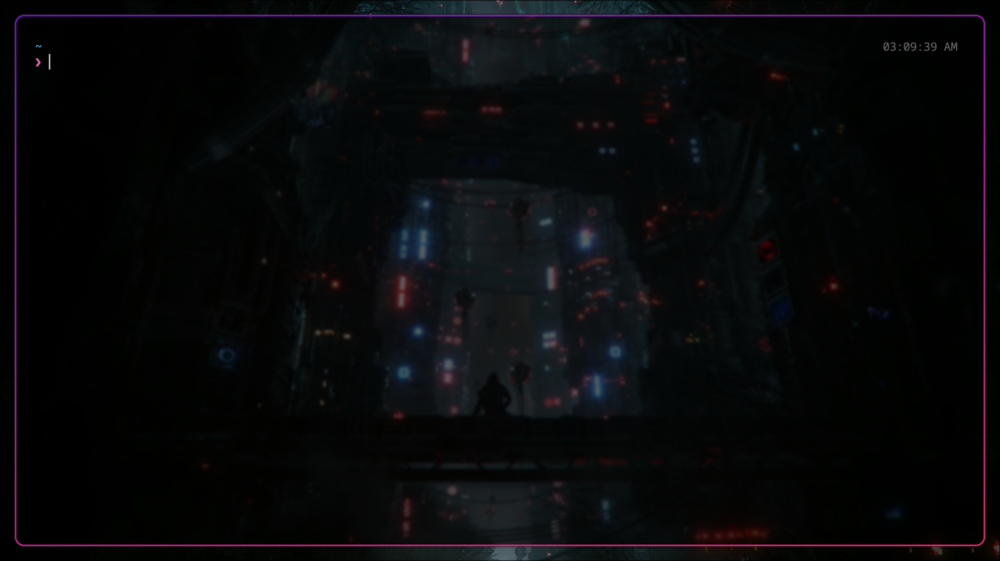
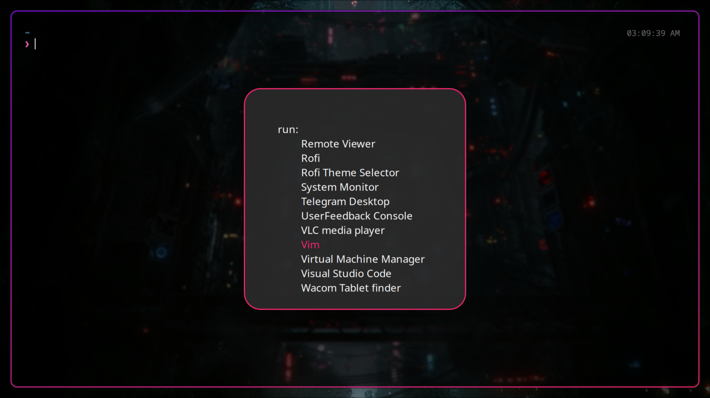
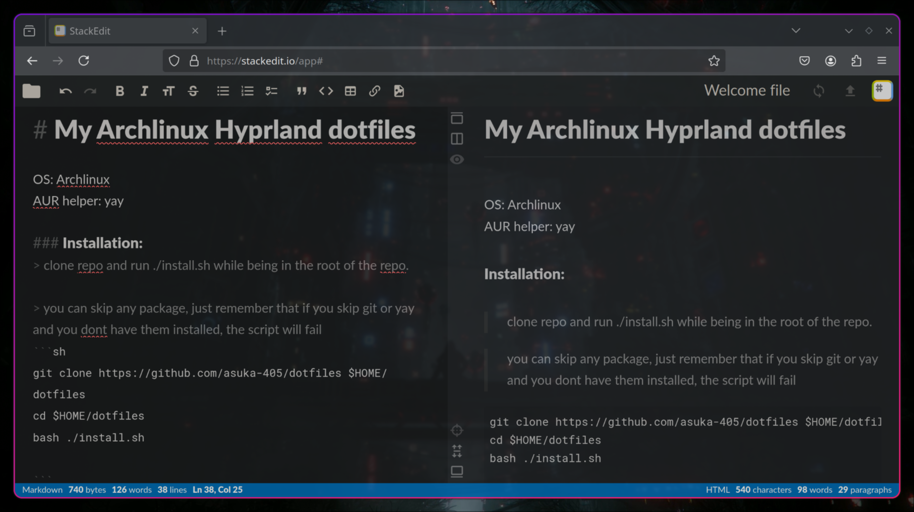
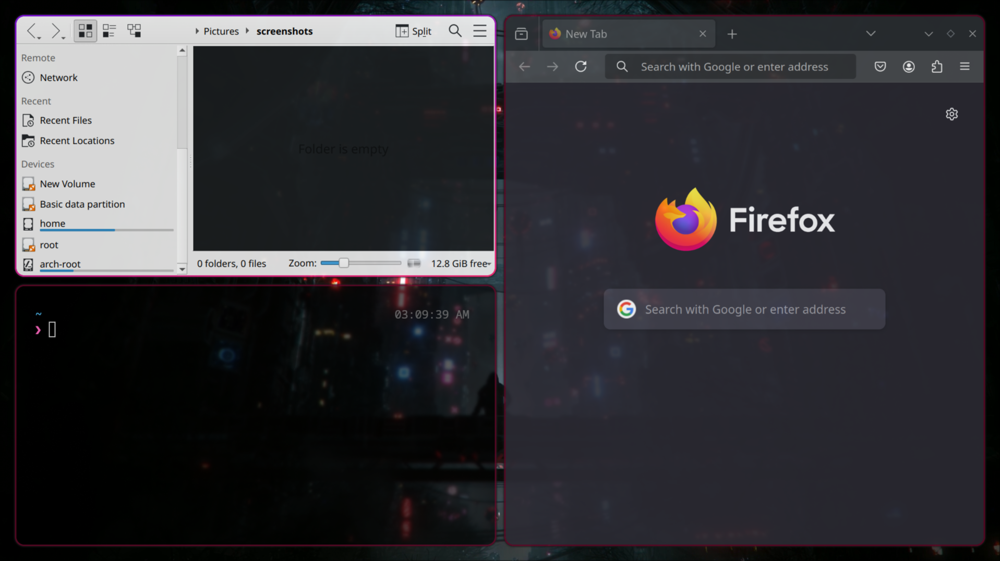
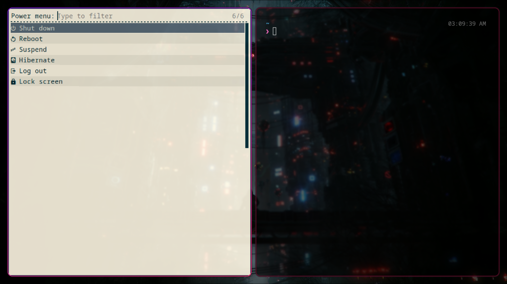

# My Archlinux Hyprland dotfiles

OS: Archlinux | AUR helper: yay

> for other distros, in the end

### Keybindings:

> Mainmod key: Win ( ⊞ )

| Key Combination | Effect                  |
| --------------- | ----------------------- |
| Mainmod +       |                         |
| Return          | Kitty terminal emulator |
| C               | VS Code                 |
| Z               | Zed                     |
| Q               | Kill active window      |
| E               | Dolphin                 |
| F               | Firefox                 |
| A               | Tofi app menu           |
| Backspace ( ⌫ ) | Power menu              |

> Key combinations of `Ctrl + Shift`

| Ctrl + Shift + |                 |
| -------------- | --------------- |
| P              | Take screenshot |

> Others are default hyprland keybindings

### Installation:

> on fresh arch installation, post-install.bash script is provided

> clone repo and run `bash ./doterize.sh` while being in the root of the repo.

> you can skip any package, just remember that if you skip git or yay and you dont have them installed, the script will fail

```sh
git clone https://github.com/asuka-405/dotfiles $HOME/dotfiles
cd $HOME/dotfiles
bash ./doterize.sh
```

### Packages to be installed:

- git
- yay
- hyprland
- rofi
- rofi-power-menu (unstyled as of now)
- tofi
- kitty
- dolphin
- gthumb
- firefox
- slurp
- grim

---

#### Screenshots

Wallpaper:


Terminal:


Tofi appmenu:


Browser:


Tiling windows:


Power menu:


---

#### Non arch distros:

install above mentioned packages and then
copy contents of `config` directory into `/home/$USER/.config`

---

### To Do:

- style power menu
- power menu getting tiled (issue)
- p10k theme default integration
